[toc]


# 0x01.金三胖

gif逐帧查看拼接得到flag，21,51,59帧。

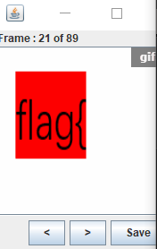

flag{he11ohongke}

# 0x02.二维码

png图片后面还有一堆东西，binwalk提取一下：

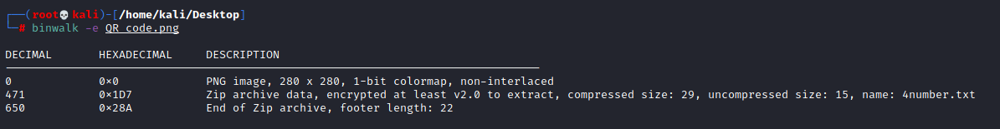

有个zip，提示4位数字，直接爆破即可，得到7639

解压得到flag

# 0x03.你竟然赶我走

jpg的一个图片，winhex打开，文件最后：

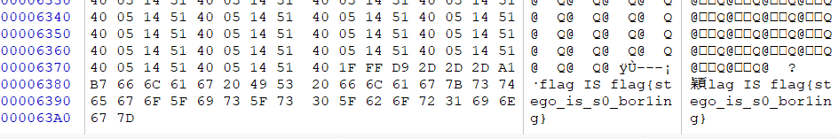

# 0x04.N种方法解决

虽然后缀是exe的文件，但其实不是pe文件，winhex打开：

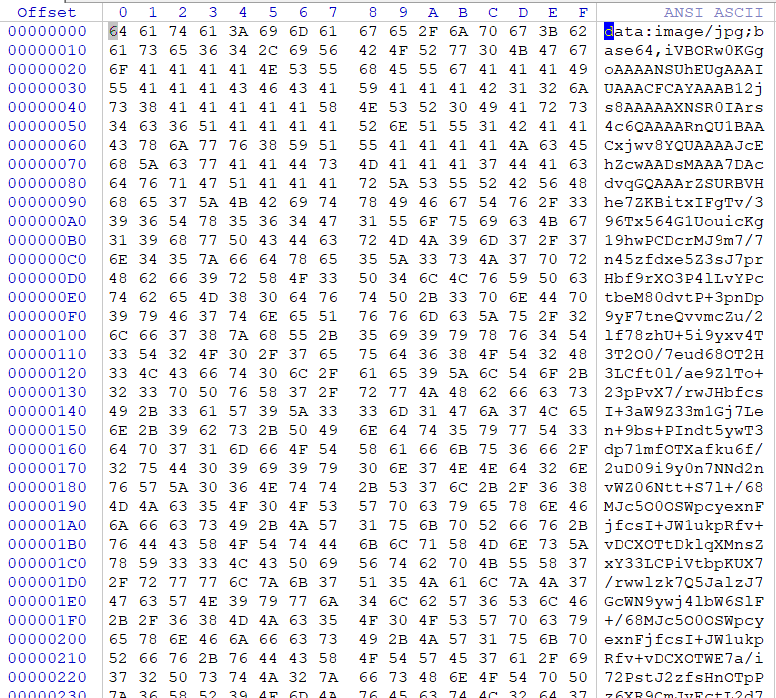

其实就是个图片，可以直接base64转图片，或者直接扔浏览器里：

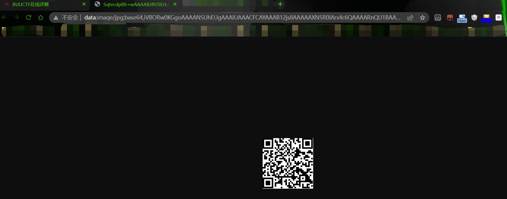

得到flag

# 0x05.大白

是个png图片，可以直接修改高度，不知道png文件格式的可以搜下

(注意这里由于是在win下，crc不会校验，之后可能会有校验crc的题。)

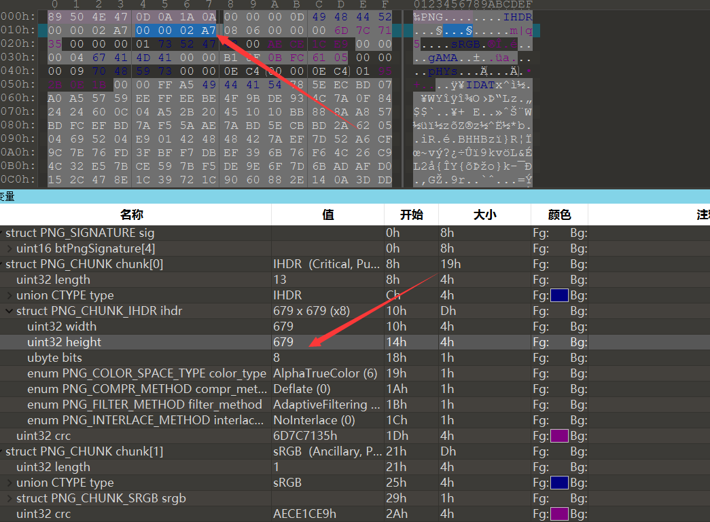

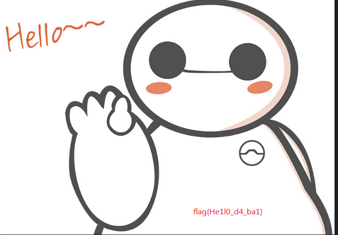


# 0x06.基础破解

提示密码为四位数字，直接爆破就行，

得到一串，base64，解密即可


# 0x07.乌镇峰会种图

文本编辑器打开或者16进制的编辑器打开都可以的：

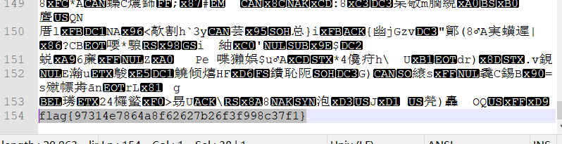


# 0x08.文件中的秘密

好久好久之前的题了，17,18年左右的了，现在不可能有这种题了......

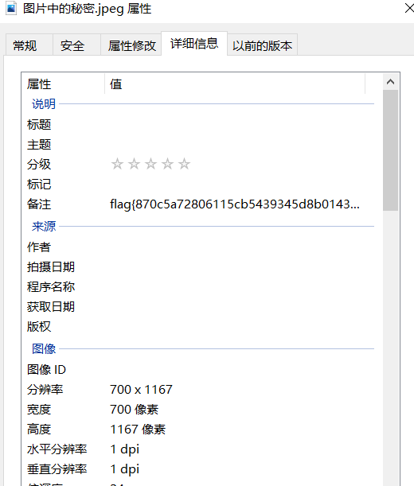

# 0x09.wireshark

提示密码相关，搜pass，password之类的字眼:

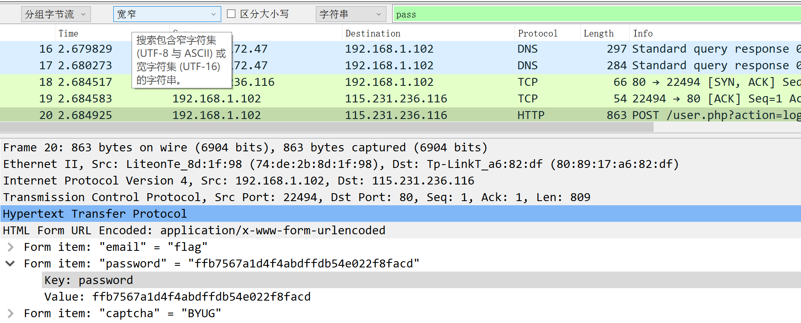


# 0x0A.LSB

提示为LSB，也就是 least significant bit，是最低有效位。

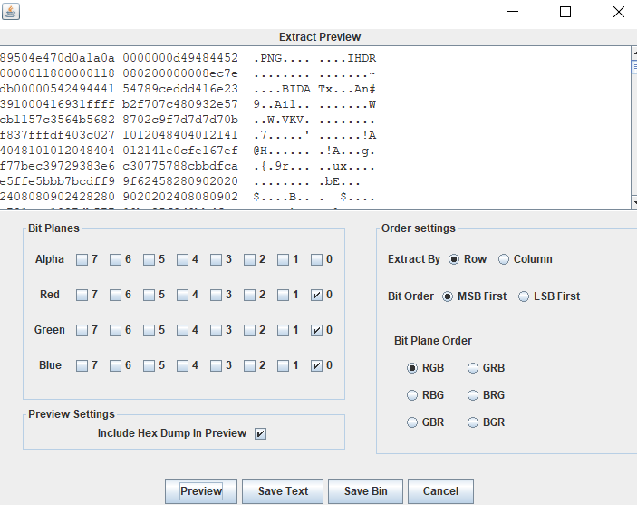

导出为png，得到二维码，扫描得flag


# 0x0B.rar

密码4位纯数字，爆破

# 0x0C.zip伪加密

提示很明显，zip的伪加密，修改标志位即可：

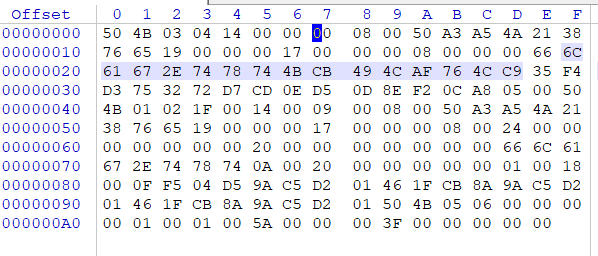

# 0x0D.qr

扫描得flag

# 0x0E.被嗅探的流量

有http的协议，wireshark导出，其中的一个：

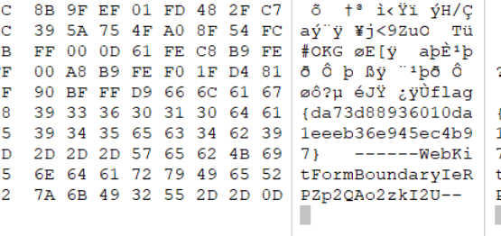

# 0x0F.镜子里面的世界

lsb图片隐写

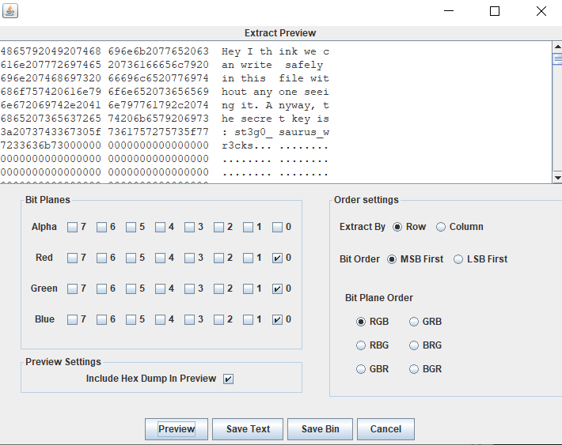

# 0x10.ningen

binwalk分离有个zip

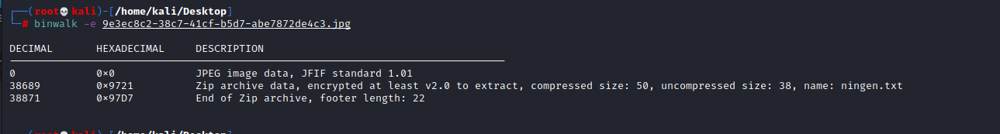

有加密，提示4位数字，爆破得flag

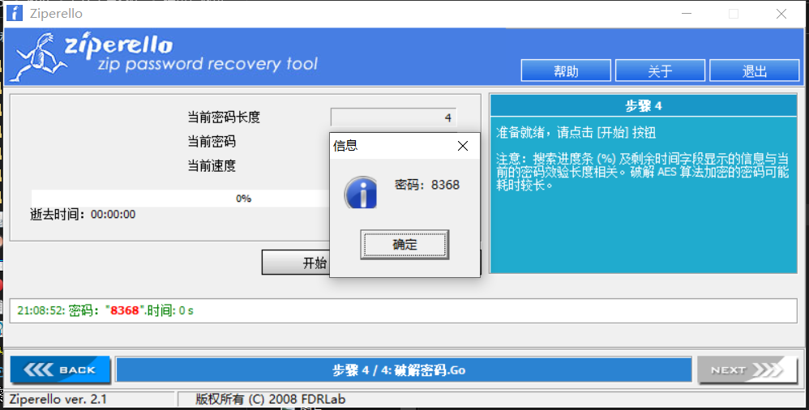


# 0x11.小明的保险箱

binwalk发现有个rar，提示4位密码，爆破得falg

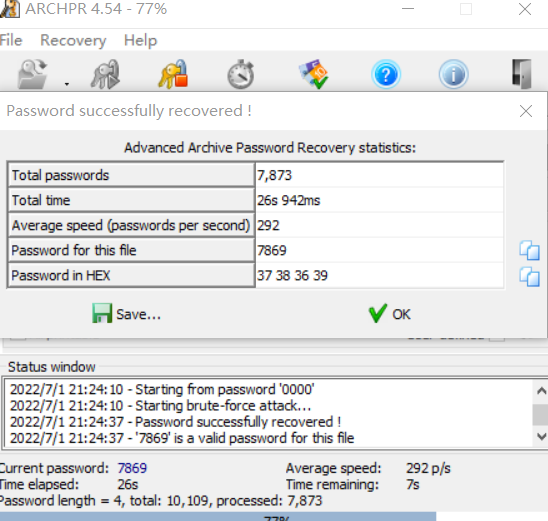


# 0x12.爱因斯坦

图片属性有密码，文件提取有压缩包，解密的flag


# 0x13.easycap

都是tcp的包，从第四个包开始，每隔一个包的最后一位都是flag，比如

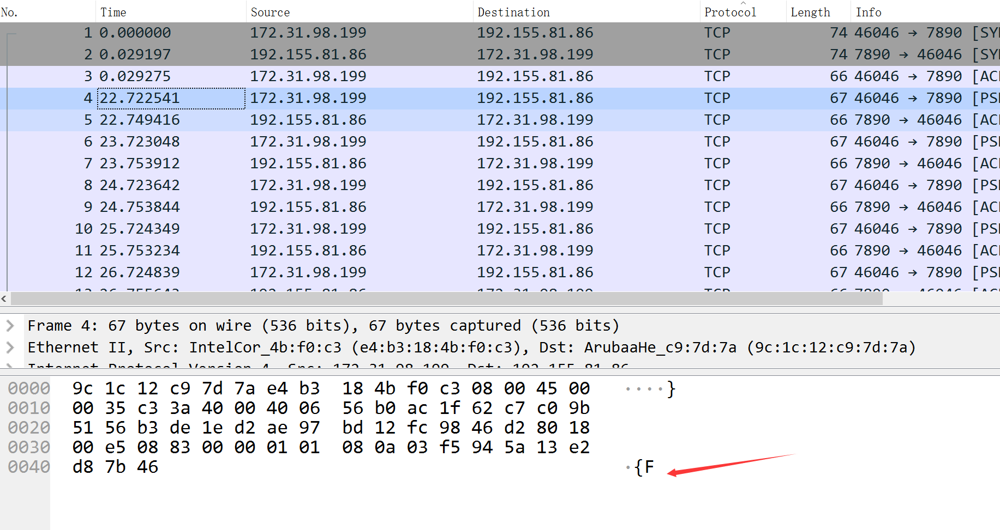

第四个是f，第6个是l，等等等得到flag

# 0x14.隐藏的钥匙

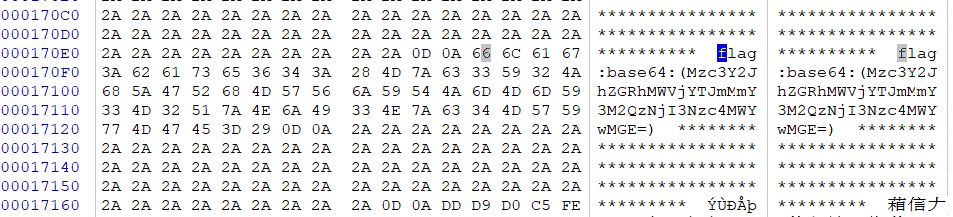

base64解密得flag

# 0x15.另外一个世界

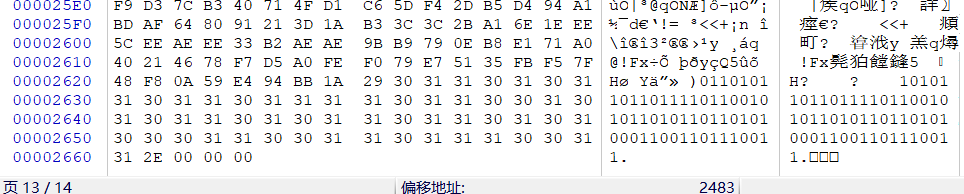

最有有一串0101，转字符得flag

# 0x16.FLAG

lsb，然后有个zip，Stegsolve提取之后解压

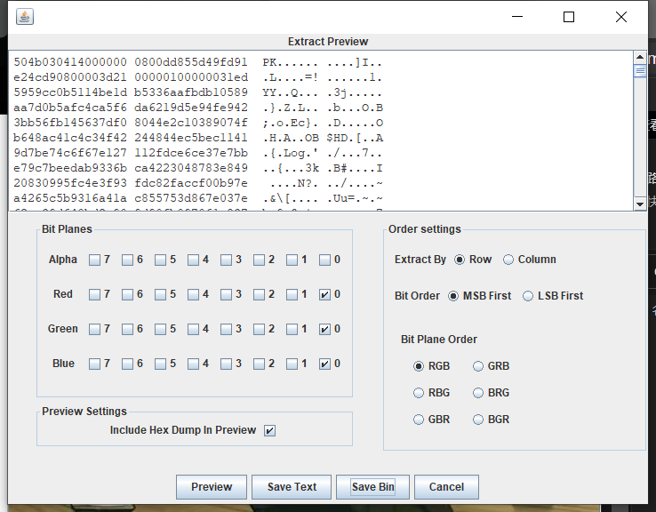

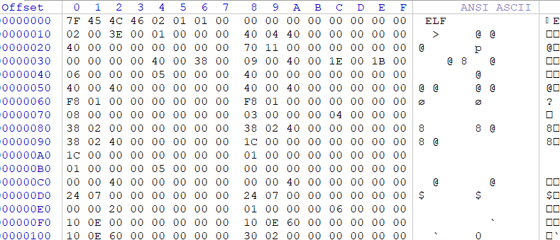

是个elf文件，elf是linux下的可执行文件，其实在后面可以找到flag，也可以放到linux执行:

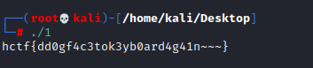

# 0x17.假如给我三天光明

有个图片和压缩包，图片是盲文，Braille盲文，对照得kmdonowg

解压得到音频文件，

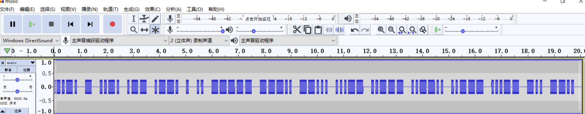摩斯码，

```
-.-. - ..-. .-- .--. . .. ----- ---.. --... ...-- ..--- ..--.. ..--- ...-- -.. --..
```

得到：wpei08732?23dz

